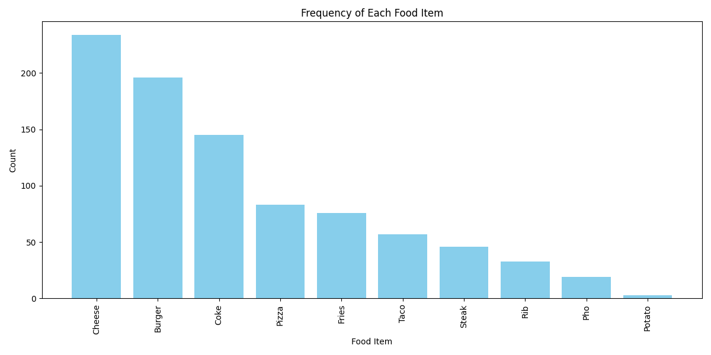

# HW2_hash_practice

## 📌 Homework Description

This program reads a text file (`hw2_data.txt`) where each line contains a single English food item. The tasks are:

1. Count how many **unique** food items appear in the file.
2. Count the **frequency** of each item.
3. Use a **hash table (dictionary)** to store the counts.
4. Plot a **bar chart** in descending order based on item frequency.

---

## 🧪 Tools Used

- **Python 3**
- `collections.defaultdict` for the hash table
- `matplotlib` for plotting

---

## 📊 Results

- **Total unique food items**: `23`
- **Top 5 most frequent items**:

| Food Item | Count |
|-----------|-------|
| Cheese    | 179   |
| Burger    | 174   |
| Coke      | 150   |
| Pizza     | 89    |
| Fries     | 76    |

---

## 📈 Plot

The bar chart below shows item frequencies from highest to lowest.



---

## 🧰 Git Instructions

```bash
git init
git add .
git commit -m "Initial commit for HW2 hash table word count"
git branch -M main
git remote add origin https://github.com/yourusername/hw2_hash_practice.git
git push -u origin main
